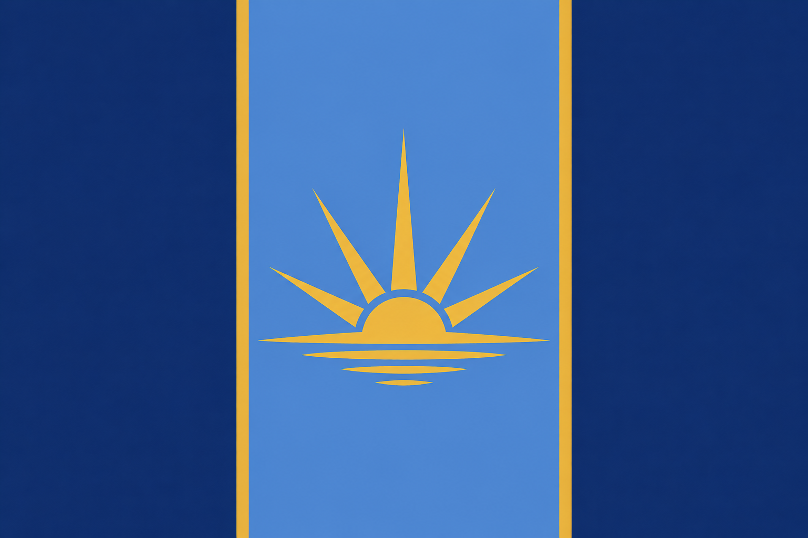

# Nations Registry

Welcome to the official registry for the nations of the server.

This site records each nation's public information, including its government, geography, culture, and laws.

## Nations

  <a class="nation-card" href="ardennes/">
    
    

      <h3>Holy Commonwealth of Ardennes</h3>
      
A constitutional religious commonwealth with regional administration, protected lands, private enterprise, and state-guided strategic industries.

    

  </a>

  <a class="nation-card" href="flux/">
    
    

      <h3>Flux Nation</h3>
      
The official public record for Flux Nation, including its government, geography, culture, and independent legal system.

    

  </a>

## About the Registry

Each nation controls the content of its own section. National law pages should contain enacted rules only; proposals and drafts should be clearly marked as such. Each nation may organize and number its laws according to its own legal system.
